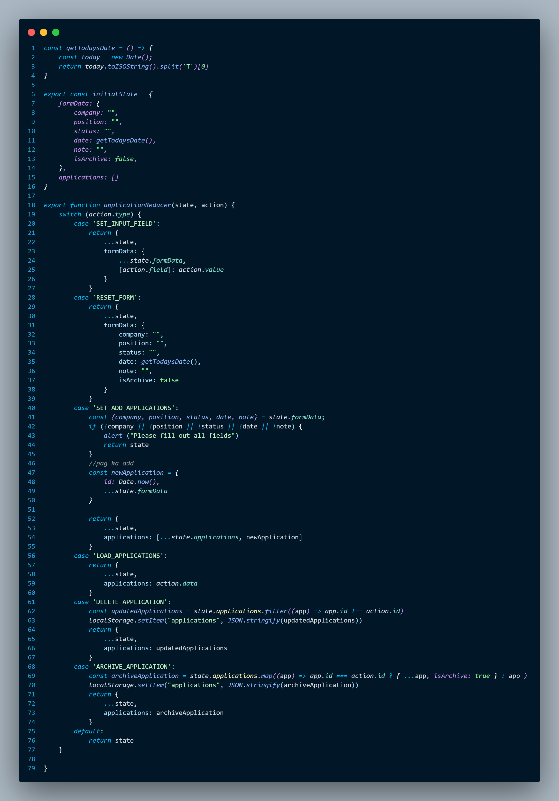
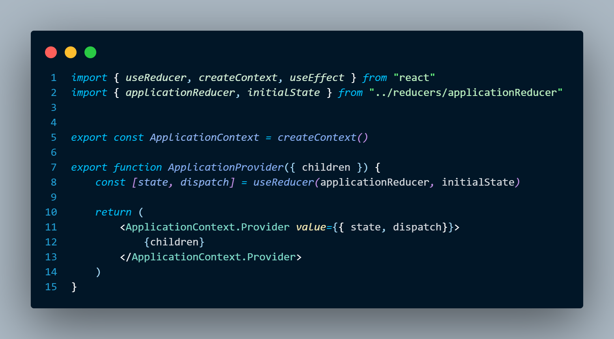

## fetching and updating data in local storage.

## Migrating from useState to useReducer for a cleaner state handling and separating it in one file.

## created an ApplicationContext to share the state, and dispatch from use reducer. and wrap its child by the provider.

Application Context

Wrapping the child with ApplicationProvider

