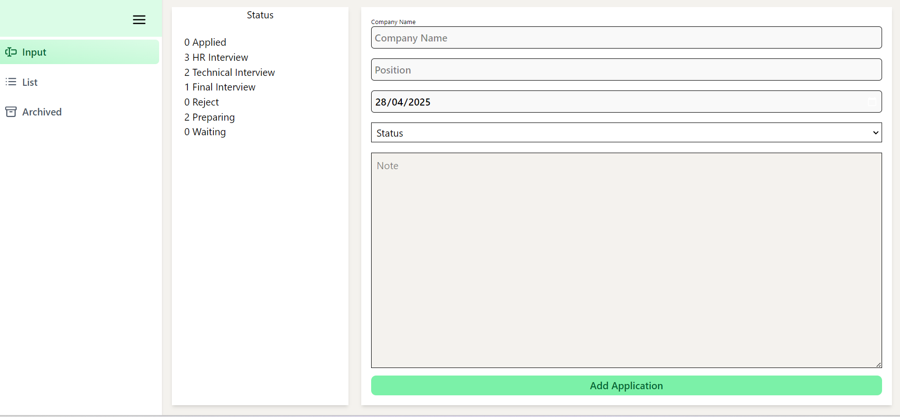
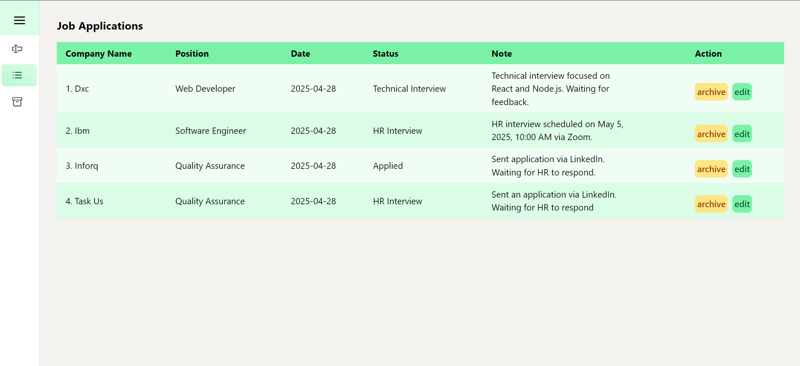
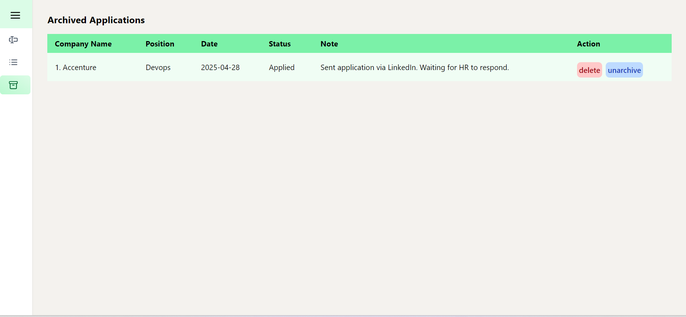

# JOB APPLICATION LEDGER

# SCREENSHOTS
## fetching and updating data in local storage.

## Migrating from useState to useReducer for a cleaner state handling and separating it in one file.

## created an ApplicationContext to share the state, and dispatch from use reducer. and wrap its child by the provider.

Application Context

Wrapping the child with ApplicationProvider

## Input page

## Lists of Job applied for 
  

## Archived applications that are no longer active

# FUTURE IMPROVEMENTS
1. add authentication or login feature
2. edit update the job application 
3. use database for storing data.